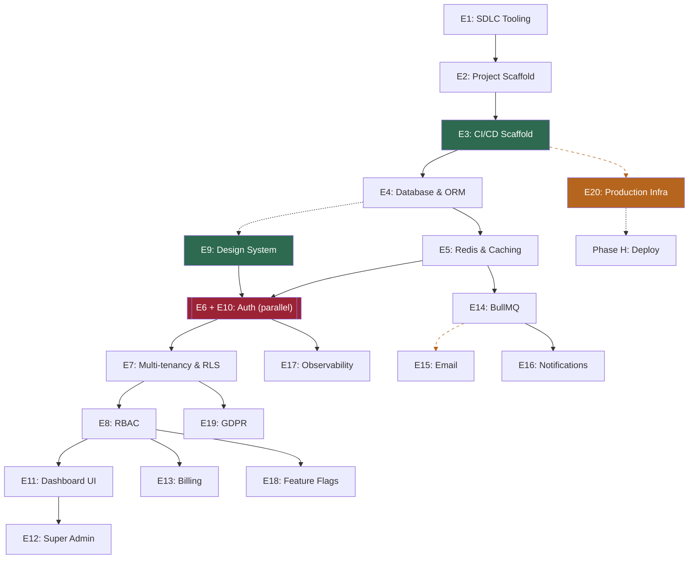

# Implementation Strategy — Epic Plan v2

> **Status**: 🚧 Epic E6+E10 Combined Auth System (next)
> **Source**: Derived from [saas-blueprint-high-level-design.md](./saas-blueprint-high-level-design.md)
> **Changelog**: v2 reorders phases to gate E6+E10 behind E9 (Design System), and moves E7+E8 to after auth (they require an authenticated session context). See rationale in each phase.

## Approach

**Workflow-first**: Before starting any epic, classify by `nature:` label to determine the correct workflow. See HLD Section 10.1 "Workflow Selection".

This document is the epic breakdown with dependency ordering. SDLC flow is applied per epic based on workflow type.

**Workflow key:**
- **A** = Full Skill Chain (`grill-me → write-a-prd → prd-to-issues → tdd`)
- **B** = Simplified Chain (task breakdown → implement → PR)
- **C** = Manual Checklist (LLM outputs steps → human executes → close)

**Nature key:**
- **code** = application code, TDD applicable
- **config** = configuration, scripts, tooling
- **manual** = out-of-codebase steps

---

## Epic Breakdown (20 Epics, 8 Phases)

### Phase A — Tooling & Scaffold

| # | Status | Epic | Nature | Workflow |
|---|--------|------|--------|----------|
| **E1** | ✅ Done | **SDLC Tooling** | `config` | B |
| | | Skills install, `UBIQUITOUS_LANGUAGE.md`, label script, PR template, ADR template | | |
| **E2** | ✅ Done | **Project Scaffold & Dev Environment** | `config` | B |
| | | Next.js, pnpm, Docker Compose (3 profiles), `.env.example`, ESLint + Prettier, Husky + lint-staged + commitlint, pre-commit validation, repo structure, root README | | |
| **E3** | ✅ Done | **CI/CD Pipeline (Scaffold)** | `config` | B |
| | | GH Actions (lint, type-check, test, build) ✅, Dockerfile ✅, smoke + full E2E split (nightly cron `0 21 * * *`) ✅, `.github/` structure ✅, E2E env template ✅, Playwright smoke stubs ✅. E3-06 (branch protection) blocked — requires GitHub Team org account (paid). E3-07 (MiniMax AI review) ✅ — SHA-pinned action, security audit in `docs/security/AI-REVIEW-AUDIT.md`. Deploy stages added in E20. | | |

**E3 Subtasks:**

| # | Status | Description | Notes |
|---|--------|-------------|-------|
| E3-01 | ✅ | Dockerfile (multi-stage Next.js) | Multi-stage, node:20-alpine, non-root |
| E3-02 | ✅ | Docker Compose (dev, e2e, container) | +100 port offset for e2e |
| E3-03 | ✅ | ci.yml (lint, type-check, test, build) | gitleaks, vitest stubs |
| E3-04 | ✅ | e2e.yml (smoke, full, nightly) | Playwright, cron 21:00 UTC |
| E3-05 | ✅ | env.e2e.example + Playwright stubs | Port offset convention, smoke test structure |
| E3-06 | ⛔ | Branch protection | Blocked — requires GitHub Team org account |
| E3-07 | ✅ | AI Review (MiniMax) | `tarmojussila/minimax-code-review`, SHA pinned, security audit in `docs/security/AI-REVIEW-AUDIT.md` |

> [!IMPORTANT]
> Every PR from E4 onward is validated by CI and AI review.

### Phase B — Backend Core *(+ E9 Design System in parallel, + E20 infra in parallel)*

| # | Status | Epic | Nature | Workflow |
|---|--------|------|--------|----------|
| **E4** | ✅ Done | **Database & ORM** | `code` | A |
| | | Postgres in Docker, Drizzle, initial schema (users, accounts, account_memberships), migrations, seed skeleton | | |
| **E5** | ✅ Done | **Redis & Caching** | `code` | B |
| | | Redis in Docker, client, namespaces, rate limiting middleware | | |

> [!NOTE]
> **Why E7 and E8 are not in Phase B:**
>
> E7 (Multi-tenancy & RLS) and E8 (RBAC) both require an authenticated session to resolve the caller's context:
> - **E7** needs Better-Auth's session to read the user's `AccountMembership` and set the PostgreSQL session variable for RLS
> - **E8** needs the session to read the user's role for `requireRole()` guards
>
> Without E6 (Auth Backend) in place, neither E7 nor E8 has a session to build on. They are moved to Phase D, after auth is complete.
>
> **Why E9 (Design System) is in parallel with Phase B:**
>
> E9 is purely a UI layer concern (shadcn/ui components, Tailwind tokens, app shell). It has zero dependencies on E5, E7, or E8 — it only needs the Next.js scaffold from E2. Starting it in parallel with E5 maximises throughput: the design system is ready by the time auth work begins.

**Running in parallel:**

| # | Status | Epic | Nature | Workflow |
|---|--------|------|--------|----------|
| **E9** | ✅ Done | **Design System & Layout Shell** | `code` | A |
| | | shadcn/ui, Tailwind, design tokens, light/dark mode, app shell, responsive (375px+) | | |
| **E20** | ⏳ Not Started | **Production Infrastructure** | `manual` | C |
| | | Server provisioning, Dokploy install, domain config, R2 buckets, Uptime Kuma, `scripts/backup-db.sh`, `scripts/cleanup-backups.sh`, `scripts/archive-audit-logs.sh`, `scripts/cleanup-queue.sh` | | |

> [!TIP]
> E9 and E20 ran in parallel with Phase B. E9 is now complete. E20 (Workflow C, nature:manual) is a human-executed checklist that runs independently of code progress.

### Phase C — Auth System *(E6 + E10, parallel workstreams)*

> [!NOTE]
> **PRD:** Issue [#108](https://github.com/Lunatic83/gas-saas/issues/108) — E6+E10 Combined Auth System. Grill-me completed, PRD authored, tasks created (#109-#120).

| # | Status | Epic | Nature | Workflow | Tasks |
|---|--------|------|--------|----------|-------|
| | | | | | |
| **E6** | ⏳ Not Started | **Auth Backend** | `code` | A |
| | | Better-Auth setup, bauth_ schema (users, sessions, accounts, verification_tokens), auth API routes, middleware with callbackUrl, email+password + email verification, magic link, OAuth (Google, GitHub), dual email provider (Ethereal/Resend), generic error messages, account linking disabled | | |
| **E10** | ⏳ Not Started | **Auth UI** | `code` | A |
| | | better-auth-ui, AuthUIProvider at root, sign-in/sign-up/forgot-password/reset-password pages, sign-out goodbye page, desktop split layout, mobile centered, protected route wrappers, layered auth pattern | | |

> [!NOTE]
> **Why E6 and E10 are combined and gated behind E9:**
>
> Better-Auth is not a pure backend library. Its integration surface spans both layers:
> - **Backend**: Better-Auth API routes, session strategy (DB + Redis), middleware
> - **Frontend**: React hooks (`useSession`, `useUser`), session context, OAuth redirect handlers, magic link UI
>
> Doing E6 first (backend-only) would require scaffolding frontend integration that gets discarded when E10 redesigns those pages using the design system. E10 cannot exist without E6's backend. The resolution: **E6 and E10 are a single auth epic** with parallel workstreams, a shared `grill-me` session, and one combined PRD. They ship together.

> [!IMPORTANT]
> **No UI epic starts before E9 is complete.** E9 provides the shadcn components and design tokens that E10 consumes — starting E10 before E9 means redesigning auth pages twice.

### Phase D — Multi-tenancy & Authorization

| # | Status | Epic | Nature | Workflow |
|---|--------|------|--------|----------|
| **E7** | ⏳ Not Started | **Multi-tenancy & RLS** | `code` | A |
| | | `tenant_id` on all product tables, RLS policies, middleware resolves active tenant from Better-Auth session | | |
| **E8** | ⏳ Not Started | **RBAC & Authorization** | `code` | B |
| | | Roles (`super_admin`, `admin`, `user`), `requirePermission` guards, ESLint rule for unguarded Server Actions | | |

> [!NOTE]
> **Why E7 and E8 come after E6+E10:**
>
> Both epics require an authenticated session context that only exists after E6 is complete:
> - **E7**: The tenant resolution middleware reads `AccountMembership` from the Better-Auth session to set the PostgreSQL `app.current_tenant_id` session variable used by RLS policies. Without a session, RLS policies cannot be meaningfully tested.
> - **E8**: Role checks (`requireRole`, `requirePermission`) operate on the authenticated user. The role assignment model (stored in `user_roles`) is seeded at registration — which is part of E6's signup flow.
>
> E7 and E8 are sequenced E7 → E8 (RLS must exist before role guards can be enforced against it).

### Phase E — UI Layer

| # | Status | Epic | Nature | Workflow |
|---|--------|------|--------|----------|
| **E11** | ⏳ Not Started | **Dashboard & Account UI** | `code` | B |
| | | Dashboard shell, account settings, subscription UI, TanStack Query, Zustand, `nuqs` | | |
| **E12** | ⏳ Not Started | **Super Admin Panel** | `code` | B |
| | | `/admin/accounts` list, 3-tab detail (overview, members, subscription), impersonation, audit log | | |

### Phase F — Business Logic & Services

| # | Status | Epic | Nature | Workflow |
|---|--------|------|--------|----------|
| **E13** | ⏳ Not Started | **Billing (Stripe)** | `code` | A |
| | | Stripe integration, webhook handler (BullMQ), subscription tiers, Customer Portal, manual override | | |
| **E14** | ⏳ Not Started | **Background Jobs (BullMQ)** | `config` | B |
| | | BullMQ setup, worker container, queue definitions, dead letter queue, graceful shutdown | | |
| **E15** | ⏳ Not Started | **Email System** | `config` | B |
| | | React Email templates, BullMQ queue for background job email processing. Note: Ethereal (dev) and Resend (prod) email sending is implemented in E6+E10. E15 moves email sending to BullMQ background jobs for high-volume production use. | | |
| **E16** | ⏳ Not Started | **Notification System** | `code` | B |
| | | `notifications` table, BullMQ dispatch, bell icon UI, polling/SSE, mark-as-read | | |

### Phase G — Observability & Compliance

| # | Status | Epic | Nature | Workflow |
|---|--------|------|--------|----------|
| **E17** | ⏳ Not Started | **Observability** | `config` | B |
| | | Pino logging, health endpoints, GlitchTip SDK, Docker log rotation, Uptime Kuma | | |
| **E18** | ⏳ Not Started | **Feature Flags (GrowthBook)** | `code` | B |
| | | SDK integration, server-side eval, Redis cache (60s), subscription tier gating | | |
| **E19** | ⏳ Not Started | **GDPR Compliance** | `code` | B |
| | | Hard delete cascade, data export, cookie consent stub, privacy/ToS pages | | |

### Phase H — Deploy & Go-Live

CI/CD deploy stages added to E3 scaffold (GHCR push, Dokploy webhook, migration runner, post-deploy health check).

---

## Dependency Graph

**Legend:**
- **Green** = critical gates (CI/CD, Design System)
- **Red** = combined auth epic (E6 + E10, parallel workstreams — ships together)
- **Orange/dashed** = parallel manual track (E20)

---

## Workflow & Nature Summary

| Nature | Count | Workflow | TDD? |
|--------|-------|----------|------|
| `code` | ~11 | A or B | Yes (A only) |
| `config` | ~7 | B | No |
| `manual` | ~1 | C | No |

See HLD Section 10.1 "Workflow Selection" for full definitions.

---

## Key Rules

1. **Every PR from E4+ runs through CI** (E3 is the gate)
2. **E9 (Design System) ran in parallel with Phase B** — it only needed the Next.js scaffold from E2, not the backend core. Now complete.
3. **E6+E10 ship together** — they are a single auth epic with parallel workstreams, not two sequential epics (PRD: #108)
4. **E7+E8 come after E6+E10** — both require an authenticated session context that only exists after auth is implemented
5. **E20 runs in parallel** with Phases B–E (manual infra, independent of code)
6. **Classify by `nature:` before starting** — choose workflow based on task type, not epic number
7. **Email system (E15) scope clarified** — E6+E10 implement email sending via Ethereal/Resend. E15 adds BullMQ background jobs for production email throughput.
