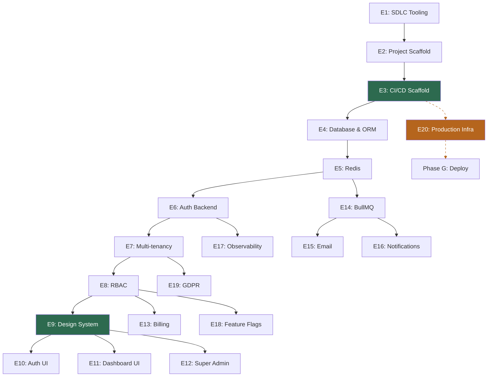

# Implementation Strategy — Epic Plan

> **Status**: 🚧 Epic 4 Next (Database & ORM)
> **Source**: Derived from [saas-blueprint-high-level-design.md](./saas-blueprint-high-level-design.md)

## Approach

**Workflow-first**: Before starting any epic, classify by `nature:` label to determine the correct workflow. See HLD Section 10.1 "Workflow Selection".

This document is the epic breakdown with dependency ordering. SDLC flow is applied per epic based on workflow type.

**Workflow key:**
- **A** = Full Skill Chain (`grill-me → write-a-prd → prd-to-issues → tdd`)
- **B** = Simplified Chain (task breakdown → implement → PR)
- **C** = Manual Checklist (LLM outputs steps → human executes → close)

**Nature key:**
- **code** = application code, TDD applicable
- **config** = configuration, scripts, tooling
- **manual** = out-of-codebase steps

---

## Epic Breakdown (20 Epics, 7 Phases)

### Phase A — Tooling & Scaffold

| # | Status | Epic | Nature | Workflow |
|---|--------|------|--------|----------|
| **E1** | ✅ Done | **SDLC Tooling** | `config` | B |
| | | Skills install, `UBIQUITOUS_LANGUAGE.md`, label script, PR template, ADR template | | |
| **E2** | ✅ Done | **Project Scaffold & Dev Environment** | `config` | B |
| | | Next.js, pnpm, Docker Compose (3 profiles), `.env.example`, ESLint + Prettier, Husky + lint-staged + commitlint, pre-commit validation, repo structure, root README | | |
| **E3** | ✅ Done | **CI/CD Pipeline (Scaffold)** | `config` | B |
| | | GH Actions (lint, type-check, test, build) ✅, Dockerfile ✅, smoke + full E2E split (nightly cron `0 21 * * *`) ✅, `.github/` structure ✅, E2E env template ✅, Playwright smoke stubs ✅. E3-06 (branch protection) blocked — requires GitHub Team org account (paid). E3-07 (MiniMax AI review) ✅ — SHA-pinned action, security audit in `docs/security/AI-REVIEW-AUDIT.md`. Deploy stages added in E20. | | |

**E3 Subtasks:**

| # | Status | Description | Notes |
|---|--------|-------------|-------|
| E3-01 | ✅ | Dockerfile (multi-stage Next.js) | Multi-stage, node:20-alpine, non-root |
| E3-02 | ✅ | Docker Compose (dev, e2e, container) | +100 port offset for e2e |
| E3-03 | ✅ | ci.yml (lint, type-check, test, build) | gitleaks, vitest stubs |
| E3-04 | ✅ | e2e.yml (smoke, full, nightly) | Playwright, cron 21:00 UTC |
| E3-05 | ✅ | env.e2e.example + Playwright stubs | Port offset convention, smoke test structure |
| E3-06 | ⛔ | Branch protection | Blocked — requires GitHub Team org account |
| E3-07 | ✅ | AI Review (MiniMax) | `tarmojussila/minimax-code-review`, SHA pinned, security audit in `docs/security/AI-REVIEW-AUDIT.md` |

> [!IMPORTANT]
> Every PR from E4 onward is validated by CI and AI review.

### Phase B — Data & Backend Core _(+ E20 infra in parallel)_

| # | Status | Epic | Nature | Workflow |
|---|--------|------|--------|----------|
| **E4** | ✅ Done | **Database & ORM** | `code` | A |
| | Postgres in Docker, Drizzle, initial schema (users, accounts, account_memberships), migrations, seed skeleton | | |
| **E5** | ⏳ Not Started | **Redis & Caching** | `code` | B |
| | Redis in Docker, client, namespaces, rate limiting middleware | | |
| **E6** | ⏳ Not Started | **Auth System (Backend)** | `code` | A |
| | Better-Auth, email+password, magic link, OAuth, sessions (DB + Redis), middleware | | |
| **E7** | ⏳ Not Started | **Multi-tenancy & RLS** | `code` | A |
| | `tenant_id` everywhere, RLS policies, middleware tenant resolution | | |
| **E8** | ⏳ Not Started | **RBAC & Authorization** | `code` | B |
| | Roles, `requirePermission` guards, ESLint rule | | |

**Running in parallel (manual):**

| # | Status | Epic | Nature | Workflow |
|---|--------|------|--------|----------|
| **E20** | ⏳ Not Started | **Production Infrastructure** | `manual` | C |
| | Server provisioning, Dokploy install, domain config, R2 buckets, Uptime Kuma, `scripts/backup-db.sh`, `scripts/cleanup-backups.sh`, `scripts/archive-audit-logs.sh`, `scripts/cleanup-queue.sh` | | |

> [!TIP]
> E20 uses Workflow C (Manual Checklist). LLM outputs step-by-step checklist; you execute it. Start alongside Phase B so infra is ready by the time features are built.

### Phase C — Design System Gate

| # | Status | Epic | Nature | Workflow |
|---|--------|------|--------|----------|
| **E9** | ⏳ Not Started | **Design System & Layout Shell** | `code` | A |
| | shadcn/ui, Tailwind, design tokens, light/dark mode, app shell, responsive (375px+) | | |

> [!IMPORTANT]
> **No UI epic starts before E9 is complete.**

### Phase D — UI Layer

| # | Status | Epic | Nature | Workflow |
|---|--------|------|--------|----------|
| **E10** | ⏳ Not Started | **Auth UI** | `code` | B |
| | Login, signup, magic link, OAuth buttons, password reset — all using design system | | |
| **E11** | ⏳ Not Started | **Dashboard & Account UI** | `code` | B |
| | Dashboard shell, account settings, subscription UI, TanStack Query, Zustand, `nuqs` | | |
| **E12** | ⏳ Not Started | **Super Admin Panel** | `code` | B |
| | `/admin/accounts` list, 3-tab detail (overview, members, subscription), impersonation, audit log | | |

### Phase E — Business Logic & Services

| # | Status | Epic | Nature | Workflow |
|---|--------|------|--------|----------|
| **E13** | ⏳ Not Started | **Billing (Stripe)** | `code` | A |
| | Stripe integration, webhook handler (BullMQ), subscription tiers, Customer Portal, manual override | | |
| **E14** | ⏳ Not Started | **Background Jobs (BullMQ)** | `config` | B |
| | BullMQ setup, worker container, queue definitions, dead letter queue, graceful shutdown | | |
| **E15** | ⏳ Not Started | **Email System** | `config` | B |
| | React Email templates, BullMQ queue, Mailhog in dev/e2e, transactional flows | | |
| **E16** | ⏳ Not Started | **Notification System** | `code` | B |
| | `notifications` table, BullMQ dispatch, bell icon UI, polling/SSE, mark-as-read | | |

### Phase F — Observability & Compliance

| # | Status | Epic | Nature | Workflow |
|---|--------|------|--------|----------|
| **E17** | ⏳ Not Started | **Observability** | `config` | B |
| | Pino logging, health endpoints, GlitchTip SDK, Docker log rotation, Uptime Kuma | | |
| **E18** | ⏳ Not Started | **Feature Flags (GrowthBook)** | `code` | B |
| | SDK integration, server-side eval, Redis cache (60s), subscription tier gating | | |
| **E19** | ⏳ Not Started | **GDPR Compliance** | `code` | B |
| | Hard delete cascade, data export, cookie consent stub, privacy/ToS pages | | |

### Phase G — Deploy & Go-Live

CI/CD deploy stages added to E3 scaffold (GHCR push, Dokploy webhook, migration runner, post-deploy health check).

---

## Dependency Graph

**Green** = critical gates (CI/CD, Design System) · **Orange/dashed** = parallel manual track

---

## Workflow & Nature Summary

| Nature | Count | Workflow | TDD? |
|--------|-------|----------|------|
| `code` | ~11 | A or B | Yes (A only) |
| `config` | ~7 | B | No |
| `manual` | ~1 | C | No |

See HLD Section 10.1 "Workflow Selection" for full definitions.

---

## Key Rules

1. **Every PR from E4+ runs through CI** (E3 is the gate)
2. **No UI work before E9** (Design System is the gate)
3. **E20 runs in parallel** with Phases B–E (manual infra, independent of code)
4. **Classify by `nature:` before starting** — choose workflow based on task type, not epic number
