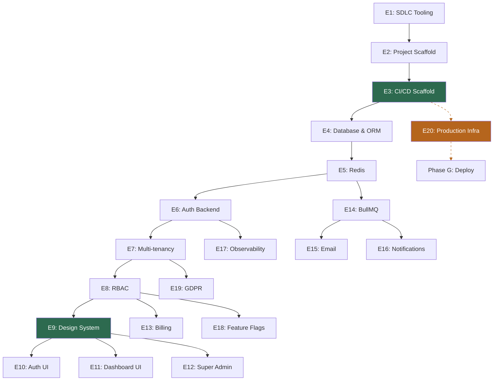

# Implementation Strategy — Epic Plan

> **Status**: 🚧 Epic 1 In Progress
> **Source**: Derived from [saas-blueprint-high-level-design.md](./saas-blueprint-high-level-design.md)

## Approach

**1 intermediate step** (this document), then iterate per epic: `grill-me` → `write-a-prd` → `prd-to-issues` → `tdd`.

Your HLD is already at medium-level detail (data models, service patterns, API contracts). A separate mid-level design would restate what's there. What you need is this **epic breakdown with dependency ordering**, then the SDLC flow per epic produces just-in-time PRDs that stay accurate.

---

## Epic Breakdown (20 Epics, 7 Phases)

### Phase A — Tooling & Scaffold

| # | Status | Epic | LLM? | Manual? |
|---|--------|------|------|---------|
| **E1** | 🚧 In Progress | **SDLC Tooling** | ✅ | None |
| | | Skills install, `UBIQUITOUS_LANGUAGE.md`, label script, PR template, ADR template | | |
| **E2** | ⏳ Not Started | **Project Scaffold & Dev Environment** | ✅ | None |
| | | Next.js, pnpm, Docker Compose (3 profiles), `.env.example`, linting/formatting, repo structure | | |
| **E3** | ⏳ Not Started | **CI/CD Pipeline (Scaffold)** | ✅ | Branch protection — manual |
| | | GH Actions (lint, type-check, test, build), Dockerfile, `.github/` structure. Deploy stages added in E20. | | |

> [!IMPORTANT]
> Every PR from E4 onward is validated by CI.

### Phase B — Data & Backend Core _(+ E20 infra in parallel)_

| # | Status | Epic | LLM? | Manual? |
|---|--------|------|------|---------|
| **E4** | ⏳ Not Started | **Database & ORM** | ✅ | None |
| | Postgres in Docker, Drizzle, initial schema (users, accounts, account_memberships), migrations, seed skeleton | | |
| **E5** | ⏳ Not Started | **Redis & Caching** | ✅ | None |
| | Redis in Docker, client, namespaces, rate limiting middleware | | |
| **E6** | ⏳ Not Started | **Auth System (Backend)** | ✅ | OAuth apps (Google, GitHub) — manual |
| | Better-Auth, email+password, magic link, OAuth, sessions (DB + Redis), middleware | | |
| **E7** | ⏳ Not Started | **Multi-tenancy & RLS** | ✅ | None |
| | `tenant_id` everywhere, RLS policies, middleware tenant resolution | | |
| **E8** | ⏳ Not Started | **RBAC & Authorization** | ✅ | None |
| | Roles, `requirePermission` guards, ESLint rule | | |

**Running in parallel (manual):**

| # | Status | Epic | LLM? | Manual? |
|---|--------|------|------|---------|
| **E20** | ⏳ Not Started | **Production Infrastructure** | ❌ | Hetzner, Dokploy, DNS/Cloudflare, R2, SSL — all manual |
| | Server provisioning, Dokploy install, domain config, R2 buckets, backup scripts | | |

> [!TIP]
> E20 is independent manual work. Start it alongside Phase B so production infra is ready by the time features are built. LLM outputs a step-by-step checklist; you execute it.

### Phase C — Design System Gate

| # | Status | Epic | LLM? | Manual? |
|---|--------|------|------|---------|
| **E9** | ⏳ Not Started | **Design System & Layout Shell** | ✅ | None |
| | shadcn/ui, Tailwind, design tokens, light/dark mode, app shell, responsive (375px+) | | |

> [!IMPORTANT]
> **No UI epic starts before E9 is complete.**

### Phase D — UI Layer

| # | Status | Epic | LLM? | Manual? |
|---|--------|------|------|---------|
| **E10** | ⏳ Not Started | **Auth UI** | ✅ | None |
| | Login, signup, magic link, OAuth buttons, password reset — all using design system | | |
| **E11** | ⏳ Not Started | **Dashboard & Account UI** | ✅ | None |
| | Dashboard shell, account settings, subscription UI, TanStack Query, Zustand, `nuqs` | | |
| **E12** | ⏳ Not Started | **Super Admin Panel** | ✅ | None |
| | `/admin/accounts` list, 3-tab detail (overview, members, subscription), impersonation, audit log | | |

### Phase E — Business Logic & Services

| # | Status | Epic | LLM? | Manual? |
|---|--------|------|------|---------|
| **E13** | ⏳ Not Started | **Billing (Stripe)** | ✅ | Stripe account/products — manual |
| | Stripe integration, webhook handler (BullMQ), subscription tiers, Customer Portal, manual override | | |
| **E14** | ⏳ Not Started | **Background Jobs (BullMQ)** | ✅ | None |
| | BullMQ setup, worker container, queue definitions, dead letter queue, graceful shutdown | | |
| **E15** | ⏳ Not Started | **Email System** | ✅ | Resend account — manual |
| | React Email templates, BullMQ queue, Mailhog in dev/e2e, transactional flows | | |
| **E16** | ⏳ Not Started | **Notification System** | ✅ | None |
| | `notifications` table, BullMQ dispatch, bell icon UI, polling/SSE, mark-as-read | | |

### Phase F — Observability & Compliance

| # | Status | Epic | LLM? | Manual? |
|---|--------|------|------|---------|
| **E17** | ⏳ Not Started | **Observability** | ⚠️ | GlitchTip + Uptime Kuma on Dokploy — manual |
| | Pino logging, health endpoints, GlitchTip SDK, Docker log rotation | | |
| **E18** | ⏳ Not Started | **Feature Flags (GrowthBook)** | ⚠️ | GrowthBook on Dokploy — manual |
| | SDK integration, server-side eval, Redis cache (60s), subscription tier gating | | |
| **E19** | ⏳ Not Started | **GDPR Compliance** | ✅ | None |
| | Hard delete cascade, data export, cookie consent stub, privacy/ToS pages | | |

### Phase G — Deploy & Go-Live

CI/CD deploy stages added to E3 scaffold (GHCR push, Dokploy webhook, migration runner, post-deploy health check).

---

## Dependency Graph

**Green** = critical gates (CI/CD, Design System) · **Orange/dashed** = parallel manual track

---

## LLM vs Manual Summary

| | Count | Examples |
|---|---|---|
| **Fully LLM** | ~14 | Scaffold, DB, RBAC, design system, all UI, BullMQ, notifications, GDPR |
| **LLM + manual** | ~4 | Auth (OAuth apps), Billing (Stripe), Email (Resend), CI/CD (GitHub) |
| **Mostly manual** | ~2 | Production infra, observability tools |

**Manual step workflow**: LLM builds code → outputs exact checklist → you execute → LLM wires in credentials and verifies.

---

## Key Rules

1. **Every PR from E4+ runs through CI** (E3 is the gate)
2. **No UI work before E9** (Design System is the gate)
3. **E20 runs in parallel** with Phases B–E (manual infra, independent of code)
