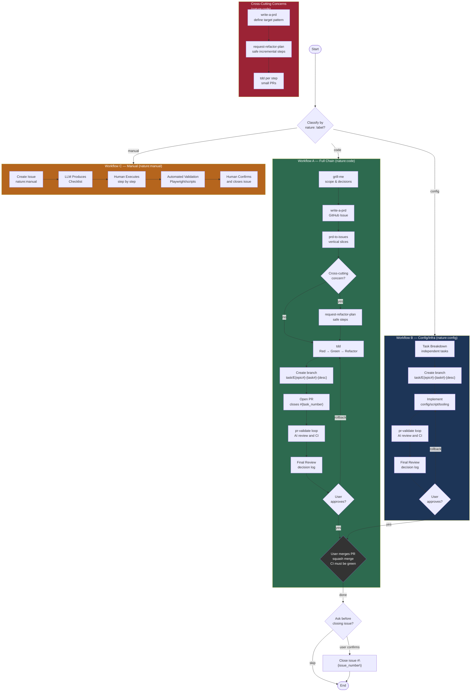
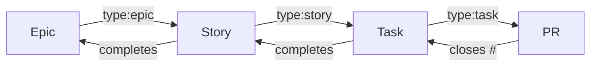
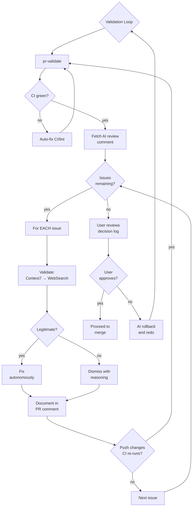
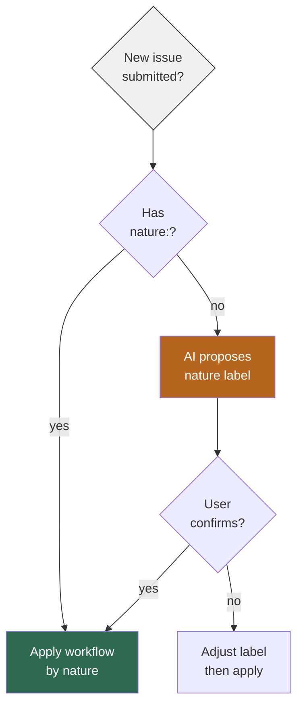
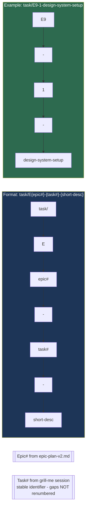

# AI-Assisted SDLC Workflow — Mermaid Chart

> Visual overview of the AI-assisted software development lifecycle workflow.
> Source: `.claude/memory/workflow_ai_sdlc.md`

## Full Workflow Diagram

---

## Issue Lifecycle

---

## Validation Loop Detail

---

## Label Rules

---

## Branch Naming Convention

---

## Key Rules Summary

| Rule | Value |
|------|-------|
| Branch format | `task/E{epic#}-{task#}-{short-desc}` |
| Merge strategy | Squash merge only |
| CI requirement | Must be green before merge — no override |
| Force push | Never to `main` |
| Issue close | Ask before closing — never auto-close |
| Validation | AI dismisses autonomously, documents every decision |
| Doc fallback | Context7 → WebSearch |
| Quality gates | Never disable ESLint/TypeScript/Prettier |
| Task sizing | Atomic, testable, minimal vertical slices (not time-based) |
| Parallelism | Tasks parallel-by-default unless explicit dependency |
| Cross-cutting | `write-a-prd` + `request-refactor-plan` in sequence |
| Trivial changes | <5 lines from manual work → batch into manual PR |
| Manual validation | Playwright/scripts → PR comment as artifact |